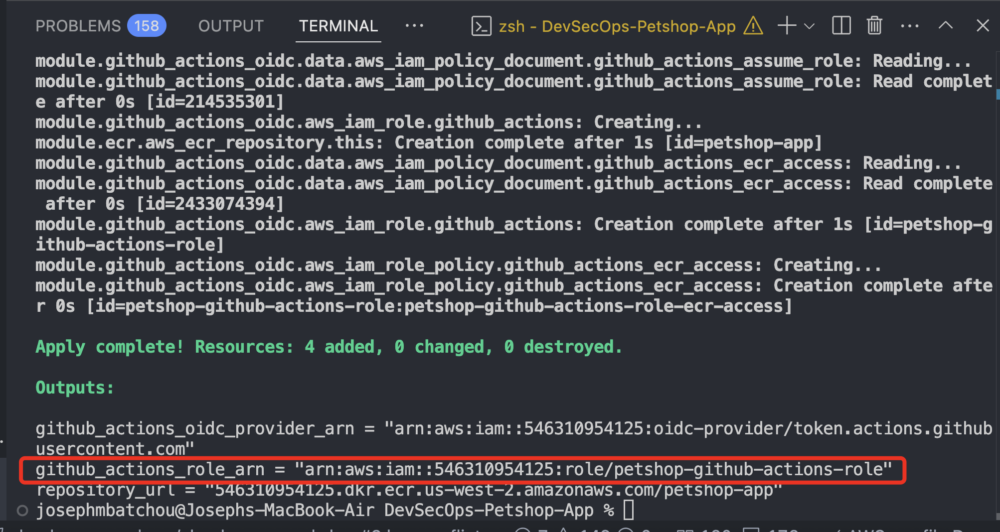
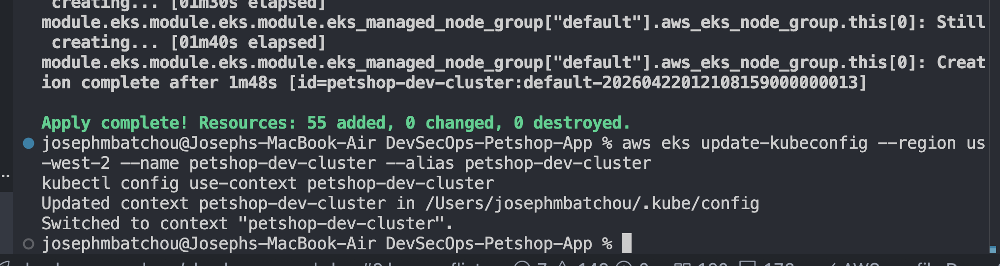
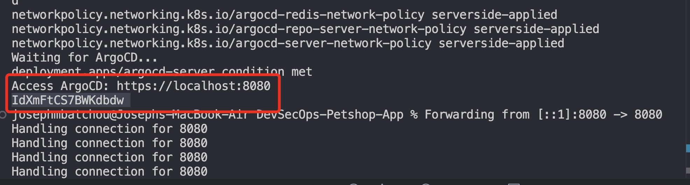
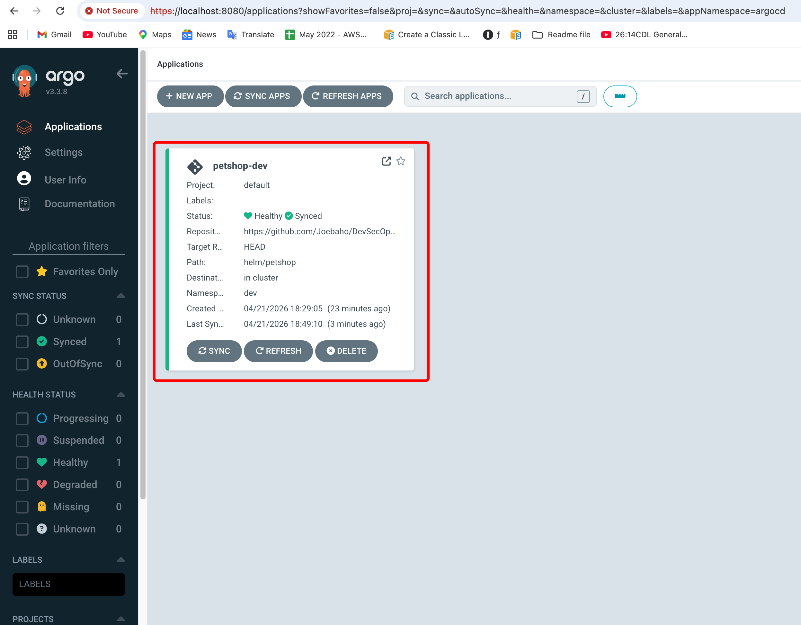
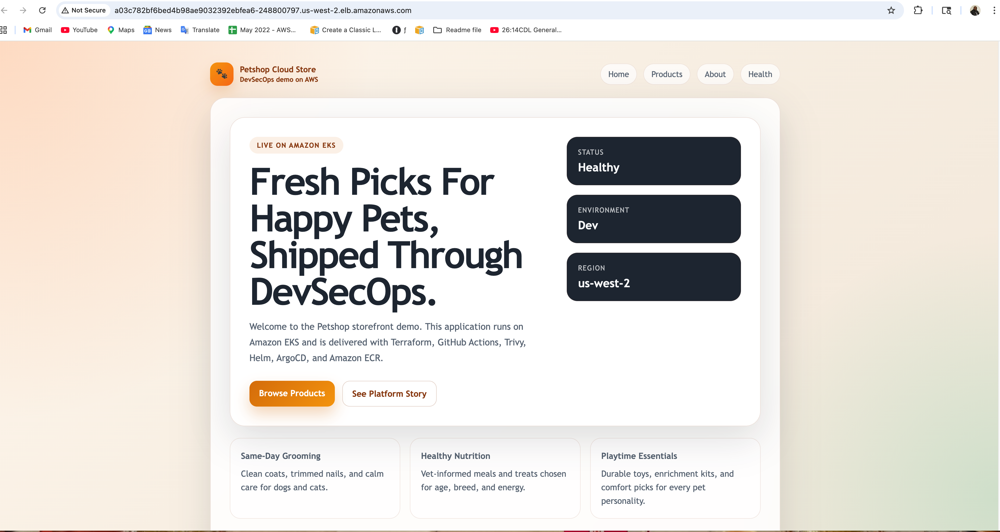

# DevSecOps Petshop Application

This repository shows a DevSecOps deployment flow for a Java application using Terraform, ECR, EKS, Helm, ArgoCD, and GitHub Actions.

## Repository
- GitHub: `https://github.com/Joebaho/DevSecOps-Petshop-App.git`
- AWS region: `us-west-2`

## What This Project Does
1. Terraform provisions AWS infrastructure.
2. GitHub Actions builds the Java app and Docker image.
3. GitHub Actions scans the image with Trivy.
4. GitHub Actions pushes the image to Amazon ECR.
5. GitHub Actions updates the Helm values for `dev`.
6. ArgoCD detects the Git change and deploys the application to EKS.
7. The same image can later be promoted to `stage` and `prod`.

## Project Layout
- `app/`: Java application and Dockerfile
- `.github/workflows/`: CI and promotion workflows
- `helm/petshop/`: Helm chart and environment values
- `gitops/`: ArgoCD applications for `dev`, `stage`, and `prod`
- `infra/`: shared Terraform plus per-environment Terraform
- `scripts/`: helper scripts for deployment, ArgoCD install, and teardown

## Environments
This project has three deployment environments:
- `dev`
- `stage`
- `prod`

Each environment has its own Terraform stack under:
- `infra/envs/dev`
- `infra/envs/stage`
- `infra/envs/prod`

## Prerequisites
Before running anything, make sure you have:
- AWS credentials configured locally
- `terraform` installed
- `kubectl` installed
- `aws` CLI installed
- access to the GitHub repository

GitHub repository settings also need:
- secret: `AWS_ROLE_ARN`
- variable: `AWS_REGION=us-west-2`
- variable: `ECR_REPOSITORY=petshop-app`

## GitHub Actions AWS Access
This project uses GitHub OIDC with an IAM role instead of long-lived AWS access keys.

Terraform creates:
- the GitHub OIDC provider
- the GitHub Actions IAM role

The CI workflow assumes that role using:
- `AWS_ROLE_ARN`

That means GitHub Actions receives temporary AWS credentials during the workflow run.

## EKS Version Note
The Terraform EKS module is configured to use Kubernetes `1.33` with Amazon Linux 2023 managed node group AMIs.
This avoids the node group creation error you can hit with older Kubernetes and AL2-based defaults.

## Option 1: Run Automatically
Use this option if you want to bootstrap the platform in one command.

Before the first run, make the scripts executable:
```bash
chmod +x ./scripts/*.sh
```

Recommended command:
```bash
./scripts/deploy-infra-and-dev.sh
```

Backward-compatible alias:
```bash
./scripts/deploy-all.sh
```

What this does:
1. Creates shared infrastructure in `infra/`
2. Creates the `dev`, `stage`, and `prod` EKS environments
3. Installs ArgoCD in each cluster
4. Registers the `dev` application by default
5. Prints the Terraform output for `github_actions_role_arn`

What you still need to do after the script finishes:
1. Copy the printed `github_actions_role_arn`
2. Add it to the GitHub secret `AWS_ROLE_ARN`
3. Confirm GitHub variables:
   - `AWS_REGION=us-west-2`
   - `ECR_REPOSITORY=petshop-app`
4. Push to `main`

By default, the script does not register `stage` and `prod` applications right away.
That is intentional, because the normal release flow is:
- deploy first to `dev`
- test
- promote the same image to `stage`
- promote the same image to `prod`

If you want to register all three applications immediately, run:
```bash
DEPLOY_STAGE_AND_PROD_APPS=true ./scripts/deploy-infra-and-dev.sh
```

## Option 2: Run Environment By Environment
Use this option if you want more control and want to explain each step separately.

### Step 1: Create Shared Infrastructure
This creates the ECR repository and the GitHub Actions IAM/OIDC resources.

```bash
terraform -chdir=infra init
terraform -chdir=infra apply
```

Then capture the outputs:
```bash
terraform -chdir=infra output
```



Copy:
- `github_actions_role_arn` into GitHub secret `AWS_ROLE_ARN`

Confirm GitHub variables:
- `AWS_REGION=us-west-2`
- `ECR_REPOSITORY=petshop-app`

### Step 2: Create One Environment
Example for `dev`:

```bash
terraform -chdir=infra/envs/dev init
terraform -chdir=infra/envs/dev apply
```



Do the same for `stage`:
```bash
terraform -chdir=infra/envs/stage init
terraform -chdir=infra/envs/stage apply
```

Do the same for `prod`:
```bash
terraform -chdir=infra/envs/prod init
terraform -chdir=infra/envs/prod apply
```

### Step 3: Connect To The Cluster
Example for `dev`:

```bash
aws eks update-kubeconfig --region us-west-2 --name petshop-dev-cluster --alias petshop-dev-cluster
kubectl config use-context petshop-dev-cluster
```

Same pattern for:
- `petshop-stage-cluster`
- `petshop-prod-cluster`

### Step 4: Install ArgoCD
If needed, make the scripts executable first:

```bash
chmod +x ./scripts/*.sh
```

Run:

```bash
./scripts/install-argocd.sh
```

This installs ArgoCD into the cluster currently selected in `kubectl`.

### Step 5: Register The Application In ArgoCD
For `dev`:

```bash
kubectl apply -f gitops/petshop-dev/app.yaml
```

For `stage`:

```bash
kubectl apply -f gitops/petshop-stage/app.yaml
```

For `prod`:

```bash
kubectl apply -f gitops/petshop-prod/app.yaml
```

## How Application Deployment Works
Infrastructure creation and application rollout are not exactly the same thing.

Infrastructure:
- can be created all at once
- can also be created one environment at a time

Application rollout:
- `dev` is the first deployment target
- `stage` and `prod` should normally receive promoted image tags later

So when someone asks if this project can be deployed in one command, the best answer is:
- the infrastructure bootstrap can be done in one command
- the application release flow still follows `dev` first, then `stage`, then `prod`

## Promotion Flow
After infrastructure is ready and `dev` is registered:

1. Push code to `main`
2. GitHub Actions runs the CI workflow
3. The workflow builds, scans, and pushes the image to ECR
4. The workflow updates `helm/petshop/values-dev.yaml`
5. ArgoCD deploys to `dev`
6. Use the `Promote` GitHub Actions workflow to update `stage` or `prod`

## ArgoCD Access
After ArgoCD is installed, the default login is:
- username: `admin`
- password: read it from the initial admin secret

Get the password with:
```bash
kubectl -n argocd get secret argocd-initial-admin-secret \
  -o jsonpath="{.data.password}" | base64 -d && echo
```

If local port `8080` is already in use, expose the ArgoCD UI on another local port:
```bash
kubectl port-forward svc/argocd-server -n argocd 9091:443
```



Then open:
- `https://localhost:9091`

If you want the default port instead, use:
```bash
kubectl port-forward svc/argocd-server -n argocd 8080:443
```

Then open:
- `https://localhost:8080`

Note:
- your browser may warn about the self-signed certificate
- accept the warning and continue



## How To Access The Application Publicly
When the deployment is complete, the app is public only if the Kubernetes service is exposed as `LoadBalancer`.

For `dev`, this is already set in:
- `helm/petshop/values-dev.yaml`

After pushing the change to GitHub and letting ArgoCD sync, get the public endpoint with:
```bash
kubectl get svc -n dev
```

Look for the `petshop` service and read the value in:
- `EXTERNAL-IP`

You can also query just the external hostname with:
```bash
kubectl get svc petshop -n dev -o jsonpath="{.status.loadBalancer.ingress[0].hostname}" && echo
```

If AWS returns an IP instead of a hostname, use:
```bash
kubectl get svc petshop -n dev -o jsonpath="{.status.loadBalancer.ingress[0].ip}" && echo
```

Once the load balancer is ready, open:
- `http://<external-hostname>`

If the value is still pending, wait a few minutes and run the command again.

## How To View The Application In The Browser
After:
- the infrastructure is created
- ArgoCD is installed
- the `petshop-dev` application is registered
- GitHub Actions has completed successfully

Use one of these two methods.

### Option 1: Quick Local Browser Test
This is the fastest way to confirm the app is working.

Run:
```bash
kubectl port-forward -n dev svc/petshop 9090:80
```

Then open:
- `http://localhost:9090`

If port `9090` is already in use, try another local port:
```bash
kubectl port-forward -n dev svc/petshop 7070:80
```

Then open:
- `http://localhost:7070`

### Option 2: Public Browser Access
The `dev` environment is configured to use:
- `service.type=LoadBalancer`

Check the service:
```bash
kubectl get svc -n dev
```

You should see the `petshop` service with an external hostname or IP in the `EXTERNAL-IP` column.

You can also query it directly:
```bash
kubectl get svc petshop -n dev -o jsonpath="{.status.loadBalancer.ingress[0].hostname}" && echo
```

If AWS returns an IP instead of a hostname:
```bash
kubectl get svc petshop -n dev -o jsonpath="{.status.loadBalancer.ingress[0].ip}" && echo
```

Then open in your browser:
- `http://<external-hostname>`

If the external value is still pending, wait a few minutes and check again:
```bash
kubectl get svc -n dev
```




### Verification Commands
If you want to confirm everything is healthy before opening the browser:
```bash
kubectl get pods -n dev
kubectl get svc -n dev
kubectl get applications -n argocd
```

Expected result:
- the `petshop` pod should be `Running`
- the `petshop-dev` ArgoCD application should be `Synced` and `Healthy`
- the service should show either a local cluster IP or an external load balancer endpoint

## Destroy Everything Automatically
To destroy everything in the correct order:

```bash
chmod +x ./scripts/*.sh
./scripts/destroy-all.sh
```

This script:
1. Deletes the ArgoCD applications
2. Destroys `prod`
3. Destroys `stage`
4. Destroys `dev`
5. Destroys shared infrastructure in `infra/`

## Destroy Environment By Environment
You can also destroy manually:

```bash
terraform -chdir=infra/envs/prod destroy
terraform -chdir=infra/envs/stage destroy
terraform -chdir=infra/envs/dev destroy
terraform -chdir=infra destroy
```

## Notes
- If ECR still contains images, Terraform may not delete the repository until it is empty.
- Your AWS credentials and `kubectl` context must still be valid during deploy or destroy.
- The CI workflow deploys through GitOps. GitHub Actions pushes the image and updates Git, while ArgoCD handles Kubernetes deployment.
- The Java app currently overrides Jetty dependencies to `9.4.58.v20250814` to reduce known issues from SparkJava's older transitive dependencies.
- `.trivyignore` temporarily suppresses `CVE-2026-2332` because the advisory references Jetty `9.4.60` as the fix, and that version is not yet available on Maven Central for this dependency line.

## 🤝 Contribution

Pull requests are welcome. For major changes, please open an issue first.

## 👨‍💻 Author

**Joseph Mbatchou**

• DevOps / Cloud / Platform  Engineer   
• Content Creator / AWS Builder

## 🔗 Connect With Me

🌐 Website: [https://platform.joebahocloud.com](https://platform.joebahocloud.com)

💼 LinkedIn: [https://www.linkedin.com/in/josephmbatchou/](https://www.linkedin.com/in/josephmbatchou/)

🐦 X/Twitter: [https://www.twitter.com/Joebaho237](https://www.twitter.com/Joebaho237)

▶️ YouTube: [https://www.youtube.com/@josephmbatchou5596](https://www.youtube.com/@josephmbatchou5596)

🔗 Github: [https://github.com/Joebaho](https://github.com/Joebaho)

📦 Dockerhub: [https://hub.docker.com/u/joebaho2](https://hub.docker.com/u/joebaho2)

---

## 📄 License

This project is licensed under the MIT License — see the LICENSE file for details.
